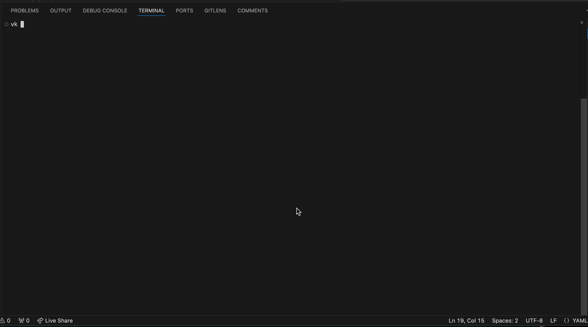

# ✍️ Proof of Concept for AsciiArtify
🔺🔺🔺🔺🔺🔺🔺🔺🔺🔺🔺🔺🔺🔺🔺🔺🔺🔺🔺🔺🔺🔺

## 📌 Intro
AsciiArtify, a startup focused on developing a new software product for transforming images into ASCII art using Machine Learning, faces the challenge of selecting the right tool for local Kubernetes cluster development. The team, comprised of two young programmers with expertise in software development but lacking DevOps experience, is considering three options: minikube, kind and k3d.

## 📌 Specifications

### 🔵 minikube
- **Supported OS, Architectures**: Compatible with Windows, macOS, and Linux. Works on various architectures.
- **Automation Capability**: Provides automation for cluster setup and management.
- **Additional Features**: Ideal for local development and testing, but scalability limitations may arise.

### 🟣 kind
- **Supported OS, Architectures**: Works on Windows, macOS, and Linux. Utilizes Docker containers.
- **Automation Capability**: Enables local Kubernetes cluster creation within Docker containers.
- **Additional Features**: Primarily suited for local testing.

### 🟢 k3d
- **Supported OS, Architectures**: Compatible with multiple operating systems. Utilizes Rancher Kubernetes Engine (RKE) in Docker containers.
- **Automation Capability**: Facilitates rapid creation and testing of Kubernetes clusters in Docker containers.
- **Additional Features**: Selected for Proof of Concept (PoC) preparation.

| Tool | Features | Automation | Additional functions | Pros | Cons |
|------------|----------------|---------------|--------------------|----------|-----------|
| 🔵 minikube   | Підтримує Linux, macOS та Windows. Можливе розгортання як у віртуальній машині, так і на bare-metal. Підтримка декількох контейнерних рантаймів. | Має прямий API-endpoint для швидкого завантаження та створення образів. | Включає додатки для легкої інсталяції Kubernetes додатків, підтримку LoadBalancer, монтування файлових систем, FeatureGates та мережеві політики. | Легкість установки та використання, низькі системні вимоги. | Призначений лише для тестування, не підходить для production кластерів. |
| 🟣 kind       | Підтримується на основних операційних системах. Використовує Docker контейнери для симуляції вузлів. | Підтримка CI/CD, можливість автоматизації через скрипти та інструменти. | Можливість моніторингу та управління кластером. | Підходить для CI/CD та тестування, легкість використання. | Може споживати більше ресурсів порівняно з іншими інструментами, складність налаштування в більших середовищах. |
| 🟢 k3d        | Підтримується на Linux та Windows. Можливість розгортання у Docker контейнерах. | Можливість легкого створення та управління кластерами. | Підтримка hot reload коду, інтеграція з Tilt для розгортання та тестування Kubernetes додатків. | Ефективне використання ресурсів, простота налаштування, підходить для локальної розробки. | Може бути нестабільним на macOS, обмежена підтримка production середовищ. |

## 📌 Demonstration
🎯 Recommended Tool: k3d  Deployment of "hello world" Application using Kubernetes

## 📌 Conclusion

`🟢 k3d` stands out as the preferred choice for several reasons:

It supports multiple operating systems and utilizes Rancher Kubernetes Engine (RKE) within Docker containers.
Automation capability allows for quick cluster creation and testing.
Lower resource consumption makes it ideal for managing multiple Kubernetes clusters.
The inclusion of configuration files simplifies team collaboration.
While all three tools have their merits, k3d strikes a balance between efficiency, ease of use, and resource optimization. For your Proof of Concept (PoC) needs, I recommend exploring k3d as a fast solution.
____